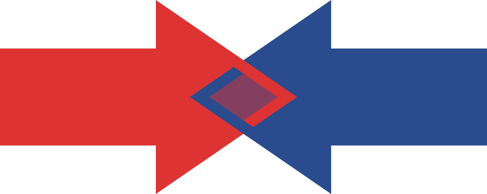

# Merge Sort
1. Introduction
Hier, tu as pu implémenter 4 algorithmes de tri (tri à bulle, tri par sélection, tri par insertion et tri rapide). Aujourd'hui, nous allons voir l'un des plus classiques.  
  
Nous allons te demander de faire un tri fusion (merge sort). Ce dernier devra être fait en récursif (🤯). L'avantage est que c'est un problème classique enseignées dans toutes les écoles de code sérieuses qui se respectent et dire que tu sais faire "un merge en récursif" te fera passer de "élève d'un bootcamp lambda" à "dév qui a fait une vraie école".  

2. Le projet
C'est simple, implémente un merge sort. C'est quoi un merge ? Nous te laissons trouver sur le net ton explication préférée ;)  
  
Je te conseille de tester ton algorithme avec plusieurs tableaux : un tableau déjà trié, un tableau très petit (3 nombres) et un tableau très grand (100 nombres). Tu devrais pouvoir constater des résultats cohérents avec les complexités indiquées dans le tableau ci-dessus.  
  
3. Rendu attendu
Un fichier JS que l'on peut exécuter en lui donnant un fichier en paramètre qui contient une liste de nombres. Il affichera dans la console le nom de l'algorithme utilisé, suivi du nombre de comparaisons effectuées puis du tableau final en sortie de ton algorithme !  
  
Je te conseille d'utiliser une class, c'est plus pratique d'avoir des attributs pour pouvoir compter le nombre de comparaisons.  
# Author
[Xabi AYCAGUER](https://www.linkedin.com/in/xabi-aycaguer/)